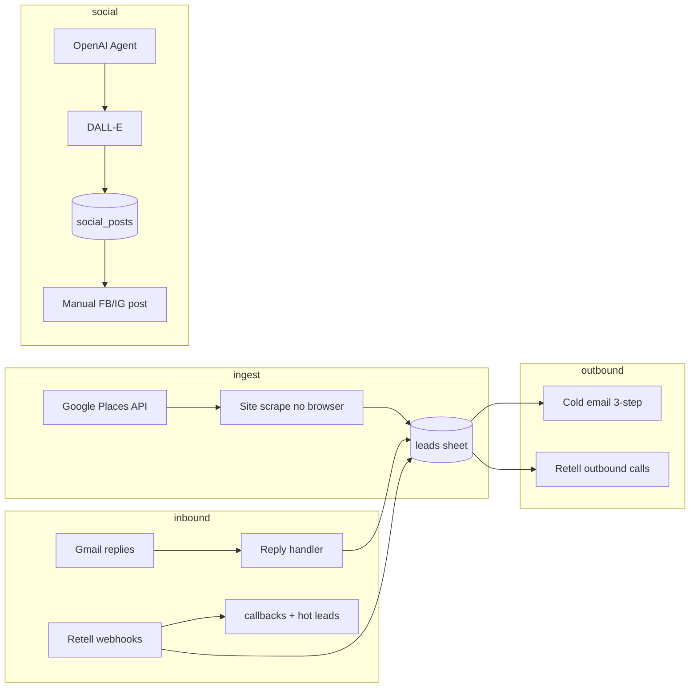

# Case study — CallsCatch client acquisition automation

## Problem

Manual prospecting and follow-up do not scale for a lean AI receptionist SaaS: finding businesses with public emails, running sequenced outreach, calling tradies, logging demo interest, and keeping social presence consistent — without a full sales team or custom backend.

## Solution

Six n8n workflows on **n8n Cloud**, with **Google Sheets** as CRM and integrations to **Google Places**, **Gmail**, **OpenAI**, **Retell AI**, and optional **Twilio** / **Meta**.

## Workflow detail

### 01 — Daily Lead Collection

- Query Google Places (New API) for target segments and geos  
- Lightweight HTTP scrape for public emails (no Puppeteer)  
- Dedupe against existing rows → append to `leads`  

### 02 — Cold Email Send

- Three-touch sequence: new → +2 days → +5 days  
- Segment-specific HTML (tradie vs health)  
- Rate limits and **`TEST_MODE`** for safe dry runs  

### 03 — Email Reply Handler

- Poll Gmail on schedule  
- Honor STOP / opt-out → `opt_out` sheet  
- Flag `hot_lead` for human follow-up  

### 04 — Outbound Calls

- Retell AI dials tradies from sheet rows  
- Batching, spacing (~4 min between calls), retry rules  

### 05 — Retell Webhooks

- `log_demo_interest` and post-call analysis  
- Update callbacks sheet; optional Twilio SMS summaries  

### 06 — Social Scheduler

- LangChain **AI Agent** (OpenAI) plans pillar, segment, caption  
- DALL·E image → Google Drive → draft row in `social_posts`  
- **Option 1:** manual Facebook/Instagram post (Meta API friction documented)  

## Design decisions

| Decision | Rationale |
|----------|-----------|
| Sheets as CRM | Zero backend ops; transparent for founder-led GTM |
| Agent + sub-workflows | Agent plans; deterministic tools mutate sheets and send email (n8n best practice) |
| No browser scrape | Lower cost and faster than headless automation |
| TEST_MODE + caps | ~25 emails / ~10 calls per weekday without runaway spend |
| AU compliance | Opt-out language in email; caller identity in Retell scripts; Melbourne TZ |
| Manual social post | Meta Graph API setup cost vs shipping value with generate-then-post |

## Challenges

1. **Meta API** — Full auto-post deferred; pipeline still produces on-brand drafts.  
2. **Retell / SIP** — Documented termination and webhook pairing for batch call nodes.  
3. **n8n batch items** — Paired-item fixes in batch workflows to avoid silent drops.  

## Metrics (adjust to your live runs)

- Up to **~25** cold emails / weekday, **~10** outbound calls / weekday, **4** social drafts / week  
- Lead ingestion without Puppeteer  
- One spreadsheet as operational source of truth  

## What to show recruiters

- Importable workflow JSON (placeholders only in public repo)  
- `TESTING.md` runbook and `.env.example`  
- Architecture diagram and this case study  
- Optional: blurred n8n canvas + sheet screenshots under `docs/images/` (add locally; no secrets)  

## Honesty note

This is **workflow engineering / growth automation** for a real product — not a public web app. That is a legitimate and in-demand specialty (RevOps, growth engineering, AI ops).
